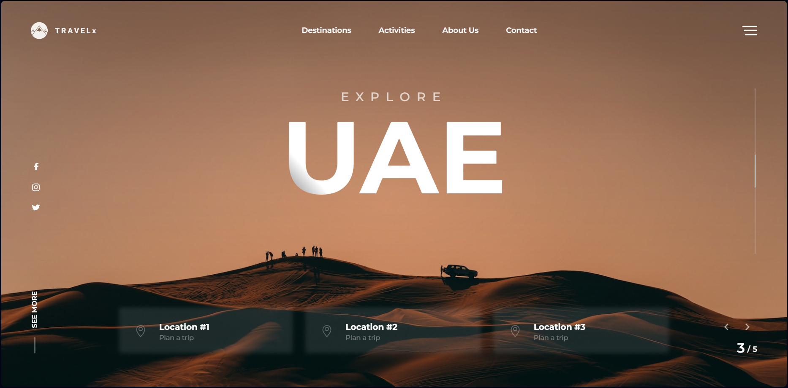

# A great stacked header with a slider in the background can be used in future projects as an interesting solution for styling the homepage

The project also implemented adaptive layout using the Mobile First technology,
styling with the SCSS preprocessor. The slider is implemented using the Swiper library

[Travel X - figma layout]([https://www.figma.com/file/ABCDEFGH/Назва-макету](https://www.figma.com/file/CSZzjKraySkNCE9J7r7GWN/Travel-X---Swiper-Header?type=design&node-id=0%3A1&mode=dev)https://www.figma.com/file/CSZzjKraySkNCE9J7r7GWN/Travel-X---Swiper-Header?type=design&node-id=0%3A1&mode=dev)

